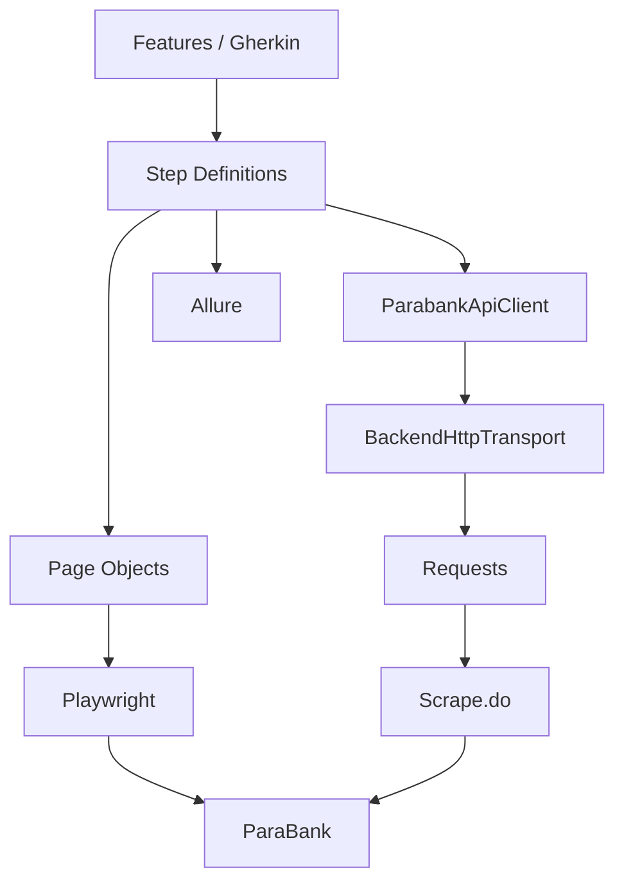

# ParaBank Automation BDD

Projeto de automação de testes funcionais end-to-end desenvolvido com **Python, Playwright e Behave**, utilizando **BDD/Gherkin**, arquitetura baseada em **Page Object Model**, preparação e validação de dados através de backend sempre que possível, relatórios com **Allure** e suporte a execução local e CI/CD.

O projeto utiliza a aplicação pública ParaBank como sistema sob teste e foi estruturado com foco em legibilidade, isolamento, reuso, confiabilidade e facilidade de execução.

---

## Objetivo

O objetivo deste projeto é demonstrar uma estratégia de automação de testes próxima de um cenário real de engenharia de qualidade, evitando tratar automação apenas como uma sequência de scripts de interface.

Foram considerados aspectos como:

* separação de responsabilidades;
* reutilização de código;
* BDD;
* Page Object Model;
* API-first para preparação de pré-condições;
* isolamento entre cenários;
* geração dinâmica de massa;
* validação pela UI e pelo backend;
* tratamento das limitações do ambiente público;
* segurança de secrets;
* observabilidade das falhas;
* relatórios;
* execução cross-platform;
* CI/CD;
* experiência de execução para usuários técnicos e não técnicos.

---

# Tecnologias

| Tecnologia        | Utilização                                   |
| ----------------- | -------------------------------------------- |
| Python            | Linguagem principal do framework             |
| Playwright        | Automação da aplicação web                   |
| Behave            | Runner BDD                                   |
| Gherkin           | Definição dos cenários                       |
| Requests          | Comunicação HTTP/backend                     |
| Pydantic Settings | Configuração por ambiente                    |
| Scrape.do         | Transporte alternativo para chamadas backend |
| Allure            | Evidências e relatório de execução           |
| GitHub Actions    | Execução automatizada em CI                  |
| Git               | Versionamento                                |

---

# Fluxos automatizados

Atualmente o projeto cobre três áreas principais da aplicação.

## Registro de usuário

Valida:

* cadastro de usuário com dados válidos;
* confirmação de senha divergente;
* tentativa de cadastro com username já existente.

O fluxo positivo de registro é executado pela própria interface quando **registro é o comportamento que está sendo testado**.

Quando o cadastro é apenas uma pré-condição para outro cenário, o framework evita repetir desnecessariamente todo o fluxo visual e utiliza a camada backend.

---

## Login

Valida:

* autenticação válida;
* username inexistente;
* senha inválida;
* campos obrigatórios ausentes.

Para o cenário de login positivo, o usuário necessário para o teste é provisionado previamente pela camada backend.

Dessa forma, o cenário testa efetivamente:

```text
Login
```

e não:

```text
Cadastro
→ Logout
→ Login
```

Essa redução de dependências torna os testes mais rápidos, focados e menos suscetíveis a falhas em componentes que não pertencem ao comportamento avaliado.

---

## Transferência de fundos

Valida:

* transferência entre contas distintas;
* exibição das informações da transferência;
* alteração correta dos saldos;
* valores inválidos;
* preservação dos saldos em operações inválidas.

A preparação do cenário utiliza backend para:

1. criar o cliente;
2. localizar o cliente;
3. localizar sua conta inicial;
4. criar uma segunda conta;
5. armazenar os saldos iniciais.

A operação de transferência é realizada pela **UI**, porque este é o comportamento sob teste.

Após a transferência, a validação ocorre em duas perspectivas:

```text
UI
+
Backend
```

A UI confirma o comportamento percebido pelo usuário.

O backend confirma o estado persistido das contas.

---

# Estratégia de automação

A arquitetura do projeto procura separar claramente:

```text
o que está sendo testado
```

de:

```text
o que é necessário apenas para preparar o teste
```

Essa diferenciação é um dos principais conceitos utilizados no framework.

---

# Estratégia API-first

Sempre que uma operação não é o comportamento que está sendo validado, o projeto prioriza sua execução através do backend.

Exemplo:

```text
Cenário: validar login

Preparação:
    criar usuário via backend

Teste:
    realizar login pela UI

Validação:
    confirmar autenticação pela UI
```

Em vez de:

```text
abrir página de registro
↓
preencher todos os campos
↓
registrar
↓
logout
↓
abrir login
↓
executar o comportamento realmente testado
```

Isso reduz:

* tempo de execução;
* quantidade de interações UI;
* flakiness;
* acoplamento entre fluxos;
* manutenção de Page Objects;
* dependência entre cenários.

---

# REST API x endpoints HTTP

Uma distinção importante do projeto é que nem todo acesso backend do ParaBank é tratado como REST.

O cadastro:

```text
POST /register.htm
```

é o endpoint utilizado pelo formulário da aplicação.

Ele depende de estado de sessão HTTP e, por isso, exige o fluxo:

```text
GET /register.htm
↓
criação da sessão
↓
POST /register.htm
```

Já operações como:

```text
login
consulta de contas
consulta de uma conta
criação de conta
```

são realizadas pelos serviços REST do ParaBank.

Essa distinção evita classificar incorretamente qualquer chamada HTTP como API REST.

---

# Arquitetura



---

# Page Object Model

A automação de interface utiliza Page Object Model para evitar que detalhes técnicos da página fiquem espalhados pelos steps.

Os arquivos de feature não conhecem:

```text
CSS
XPath
IDs
DOM
Playwright
```

Os steps descrevem ações.

Os Page Objects encapsulam a interação com a aplicação.

Exemplo conceitual:

```text
Feature

Quando realizo uma transferência

        ↓

Step Definition

transfer_page.transfer(...)

        ↓

TransferPage

locators
interações
esperas
assertions específicas
```

Isso melhora:

* legibilidade;
* manutenção;
* reutilização;
* separação de responsabilidades.

---

# BDD

Os cenários utilizam **Gherkin** através do Behave.

Exemplo conceitual:

```gherkin
Cenário: Transferência entre contas distintas

  Dado que estou autenticado com um usuário provisionado via backend
  E possuo duas contas

  Quando realizo uma transferência entre essas contas

  Então a transferência deve ser concluída

  E os saldos devem refletir a operação
```

O objetivo é manter o Gherkin próximo da linguagem de negócio.

Detalhes como:

```text
selectors
requests
payloads
IDs internos
esperas técnicas
```

permanecem fora das features.

BDD é utilizado como uma ferramenta de comunicação e organização, e não apenas como uma camada adicional sobre o código.

---

# Estrutura do projeto

```text
parabank-automation-bdd/
│
├── .github/
│   └── workflows/
│       └── e2e.yml
│
├── config/
│   └── settings.py
│
├── features/
│   │
│   ├── login.feature
│   ├── registration.feature
│   ├── transfer.feature
│   │
│   ├── environment.py
│   │
│   └── steps/
│       ├── login_steps.py
│       ├── registration_steps.py
│       └── transfer_steps.py
│
├── pages/
│   ├── base_page.py
│   ├── login_page.py
│   ├── register_page.py
│   └── transfer_page.py
│
├── services/
│   ├── http_transport.py
│   └── parabank_api_client.py
│
├── scripts/
│   └── run.py
│
├── utils/
│   └── test_data.py
│
├── reports/
│   ├── allure-results/
│   └── allure-report/
│
├── .env
├── .env.example
├── .gitignore
├── behave.ini
├── requirements.txt
├── run_tests.bat
├── run_tests.sh
└── README.md
```

---

# Responsabilidade das principais camadas

## `features/`

Contém os comportamentos descritos em Gherkin.

A feature deve explicar:

```text
o que o sistema deve fazer
```

e não:

```text
como Playwright executa a ação
```

---

## `features/steps/`

Implementa o vínculo entre Gherkin e o framework.

Os steps coordenam:

* Page Objects;
* criação de massa;
* chamadas backend;
* assertions do cenário.

---

## `pages/`

Responsável pela interação com a aplicação web.

Inclui:

* locators;
* navegação;
* preenchimento;
* cliques;
* assertions específicas da página.

---

## `services/`

Responsável pela integração com o backend.

A principal abstração é:

```text
ParabankApiClient
```

O client não precisa saber diretamente como a chamada chegará ao ParaBank.

Essa decisão é delegada a:

```text
BackendHttpTransport
```

---

## `config/`

Centraliza as configurações do projeto.

Exemplos:

* URL do ambiente;
* browser;
* headless/headed;
* timeouts;
* estratégia de transporte;
* configuração Scrape.do.

---

## `utils/`

Contém utilidades reutilizáveis, como geração de massa sintética.

---

## `scripts/run.py`

É o runner técnico principal.

É responsável por:

* criação da `.venv`;
* atualização das dependências;
* instalação dos browsers Playwright;
* preparação da execução;
* seleção de escopo;
* execução do Behave;
* propagação correta do exit code.

Os scripts:

```text
run_tests.bat
run_tests.sh
```

não duplicam essa responsabilidade.

Eles funcionam como uma interface amigável sobre o runner.

---

# Runner interativo

Para facilitar a execução por pessoas que não conhecem Python, Behave ou Playwright, existem dois runners interativos.

Windows:

```text
run_tests.bat
```

Linux/macOS:

```text
run_tests.sh
```

Eles orientam o usuário durante toda a execução.

O runner pergunta:

```text
Qual escopo deseja executar?

Qual navegador deseja utilizar?

Deseja visualizar o navegador?

Deseja abrir o Allure Report?
```

Antes da execução também é apresentado um resumo das opções escolhidas.

---

# Execução no Windows

A forma mais simples é executar:

```text
run_tests.bat
```

Ele também pode ser aberto com duplo clique.

O assistente realiza automaticamente as verificações iniciais.

---

# Execução no Linux/macOS

Primeiro torne o arquivo executável:

```bash
chmod +x run_tests.sh
```

Depois:

```bash
./run_tests.sh
```

---

# Execução manual

Usuários técnicos podem utilizar diretamente o runner Python.

## Suite completa

```bash
python scripts/run.py
```

---

## Login

```bash
python scripts/run.py --scope login
```

---

## Registro

```bash
python scripts/run.py --scope registration
```

---

## Transferência

```bash
python scripts/run.py --scope transfer
```

---

## Smoke Tests

```bash
python scripts/run.py --tags "@smoke"
```

---

## Exibir navegador

```bash
python scripts/run.py --headed
```

---

## Firefox

```bash
python scripts/run.py --browser firefox
```

---

## WebKit

```bash
python scripts/run.py --browser webkit
```

---

## Transferência em modo visual

```bash
python scripts/run.py \
  --scope transfer \
  --headed
```

---

# Configuração do ambiente

O projeto utiliza variáveis de ambiente.

O arquivo:

```text
.env.example
```

serve apenas como modelo.

O arquivo:

```text
.env
```

contém a configuração local e **não deve ser versionado**.

Exemplo:

```env
BASE_URL=https://parabank.parasoft.com/parabank

HEADLESS=true
BROWSER=chromium

PW_TIMEOUT_MS=10000
PW_NAVIGATION_TIMEOUT_MS=15000
REQUEST_TIMEOUT_SECONDS=15

BACKEND_TRANSPORT=proxy
BROWSER_TRANSPORT=direct

BLOCK_NONESSENTIAL_RESOURCES=true
UI_SCENARIO_DELAY_SECONDS=2.0

SCRAPE_DO_TOKEN=

SCRAPE_DO_API_URL=https://api.scrape.do/
SCRAPE_DO_PROXY_URL=http://proxy.scrape.do:8080
SCRAPE_DO_BROWSER_PROXY_PARAMS=render=false
```

O valor real de:

```text
SCRAPE_DO_TOKEN
```

deve existir somente no `.env` local ou como secret no CI.

---

# Por que o projeto utiliza Scrape.do?

A aplicação utilizada pelos testes é a instância **pública e compartilhada** do ParaBank.

Durante o desenvolvimento foram observadas limitações do ambiente, como:

```text
HTTP 429 Too Many Requests
```

e bloqueio temporário do Cloudflare:

```text
Error 1015
You are being rate limited
```

Esses erros são limitações de infraestrutura do ambiente público e não fazem parte do comportamento funcional que os cenários pretendem avaliar.

Abandonar as chamadas backend e criar todas as pré-condições pela UI apenas para contornar essa limitação reduziria a qualidade arquitetural do projeto.

A solução adotada foi manter a estratégia API-first e encapsular a limitação de infraestrutura em uma camada de transporte.

---

# Scrape.do como adapter de infraestrutura

Os steps não conhecem Scrape.do.

O fluxo é:

```text
Step
  ↓
ParabankApiClient
  ↓
BackendHttpTransport
  ↓
Scrape.do
  ↓
ParaBank
```

Portanto, um step continua utilizando:

```python
context.api_client.register_user(...)
```

e não:

```python
scrape_do(...)
```

Isso permite trocar a infraestrutura sem alterar os cenários.

---

# Transporte configurável

O backend suporta estratégias diferentes.

## Direct

```env
BACKEND_TRANSPORT=direct
```

Fluxo:

```text
Framework
   ↓
ParaBank
```

---

## Proxy

```env
BACKEND_TRANSPORT=proxy
```

Fluxo:

```text
Framework
   ↓
Scrape.do
   ↓
ParaBank
```

Essa é a configuração recomendada para a instância pública utilizada pelo projeto.

---

## Auto

```env
BACKEND_TRANSPORT=auto
```

Conceitualmente:

```text
Framework
   ↓
ParaBank
   ↓
403 / 429
   ↓
Scrape.do
   ↓
ParaBank
```

A existência dessas estratégias permite adaptar o framework ao ambiente sem alterar testes.

---

# Por que o browser não utiliza Scrape.do?

Foi considerada e validada também a possibilidade de rotear todo o Playwright pelo proxy.

Entretanto, um navegador gera diversas requisições concorrentes:

```text
HTML
CSS
JavaScript
imagens
fonts
assets
XHR
```

Dependendo do plano utilizado no Scrape.do, essa concorrência pode atingir o limite do próprio serviço.

Por isso a configuração adotada é:

```env
BACKEND_TRANSPORT=proxy
BROWSER_TRANSPORT=direct
```

Assim:

```text
Backend
    ↓
Scrape.do
    ↓
ParaBank
```

enquanto:

```text
Playwright
    ↓
ParaBank
```

diretamente.

Essa escolha reduz custo e concorrência no proxy e mantém seu uso apenas onde ele agrega valor.

---

# Redução de tráfego da UI

Como o ParaBank é um ambiente público compartilhado, o browser bloqueia recursos que não são necessários para as validações funcionais.

São bloqueados:

```text
image
font
media
```

Scripts e stylesheets continuam habilitados porque podem alterar comportamento e visibilidade da aplicação.

Isso reduz o volume de requests sem comprometer as validações funcionais.

---

# Pacing entre cenários

Existe também um pequeno intervalo configurável entre cenários.

```env
UI_SCENARIO_DELAY_SECONDS=2.0
```

Esse intervalo não é utilizado para sincronizar elementos da aplicação.

Ou seja, o framework não faz:

```text
click
↓
sleep 3
↓
assert
```

A sincronização funcional continua sendo responsabilidade dos mecanismos de auto-waiting e expectations do Playwright.

O intervalo entre cenários existe exclusivamente como controle de tráfego contra um ambiente público.

---

# Esperas e sincronização

O framework evita waits fixos para sincronização da interface.

Playwright já possui auto-waiting para ações como:

* click;
* fill;
* locator;
* assertions.

Também são utilizadas expectations para aguardar estados observáveis.

Para consistência eventual de backend, é utilizado polling.

Exemplo conceitual:

```text
consultar saldo
↓
saldo esperado?
   ↓
não
   ↓
aguardar intervalo curto
   ↓
consultar novamente
```

Isso é preferível a:

```python
time.sleep(5)
```

porque o teste continua imediatamente quando a condição esperada é alcançada.

---

# Isolamento entre cenários

Cada cenário recebe um novo:

```text
BrowserContext
```

Isso reduz vazamento de:

* cookies;
* storage;
* autenticação;
* estado entre testes.

O browser pode ser reutilizado durante a suíte, mas o contexto é isolado por cenário.

---

# Massa de testes

Os usuários são gerados dinamicamente.

O framework evita nomes fixos como:

```text
testuser
user123
qauser
```

que causariam conflitos após múltiplas execuções.

Os identificadores utilizam valores únicos, permitindo execuções repetidas sem depender do estado de execuções anteriores.

Todos os dados utilizados são **dados sintéticos de teste**.

Credenciais reais não devem ser utilizadas.

---

# Limitação de teardown no ambiente público

O ParaBank público não oferece um mecanismo apropriado para remover de maneira segura apenas os clientes criados por uma determinada execução.

Por isso o projeto não utiliza operações administrativas destrutivas como:

```text
cleanDB
```

contra a instância pública.

A estratégia adotada é:

```text
massa única por cenário
+
isolamento
```

Essa decisão evita modificar globalmente um ambiente compartilhado por outros usuários.

O acúmulo de dados é considerado uma limitação conhecida do ambiente de demonstração.

Em um ambiente controlado, uma estratégia apropriada de teardown poderia ser implementada.

---

# Valores monetários

Operações financeiras utilizam:

```python
Decimal
```

em vez de:

```python
float
```

Isso evita imprecisões binárias características de ponto flutuante.

---

# Transferência entre contas distintas

O cenário positivo garante que origem e destino sejam contas diferentes.

A preparação:

1. encontra a conta inicial;
2. cria uma segunda conta;
3. confirma que os IDs são diferentes;
4. captura os saldos;
5. realiza a transferência;
6. verifica os saldos finais.

Isso evita um falso cenário de transferência da conta para ela mesma.

---

# Validação negativa

Cenários negativos procuram validar explicitamente o comportamento esperado.

O projeto evita assertions permissivas como:

```text
mensagem de sucesso não apareceu
```

como única evidência de falha.

Quando possível, valida:

* mensagem esperada;
* ausência do sucesso;
* estado final do backend.

---

# Tratamento de respostas REST

As chamadas REST solicitam explicitamente:

```http
Accept: application/json
```

O framework também possui validação defensiva para respostas que deveriam ser JSON.

Caso o backend ou transporte devolva HTML/XML inesperadamente, o erro apresenta informações úteis, como:

```text
HTTP status
Content-Type
transport utilizado
preview do body
operação executada
```

em vez de apenas:

```text
JSONDecodeError
```

---

# Segurança do Scrape.do

O token do Scrape.do nunca deve ser versionado.

Não faça:

```python
SCRAPE_DO_TOKEN = "token_real"
```

Também não faça:

```env
# .env.example
SCRAPE_DO_TOKEN=token_real
```

O correto é:

```env
SCRAPE_DO_TOKEN=
```

no exemplo.

E:

```env
SCRAPE_DO_TOKEN=valor_real
```

somente no `.env` local.

---

# Proteção do token nos logs

Chamadas ao Scrape.do incluem autenticação na própria requisição do provider.

Para evitar exposição acidental, a camada de transporte sanitiza o objeto `Response` antes de gerar erros.

Dessa forma, exceptions como:

```python
response.raise_for_status()
```

não devem revelar o token através da URL interna do provider.

---

# GitHub Actions

No CI, o token deve ser armazenado como:

```text
Repository Secret
```

com o nome:

```text
SCRAPE_DO_TOKEN
```

O workflow utiliza:

```yaml
env:
  BACKEND_TRANSPORT: proxy
  BROWSER_TRANSPORT: direct
  SCRAPE_DO_TOKEN: ${{ secrets.SCRAPE_DO_TOKEN }}
```

Secrets nunca devem ser escritos diretamente no arquivo de workflow.

---

# Allure Report

O projeto utiliza:

```text
allure-behave
```

para produzir os resultados da execução.

Os resultados são salvos em:

```text
reports/allure-results
```

O **Allure CLI** transforma esses resultados em um relatório HTML.

O relatório gerado fica em:

```text
reports/allure-report
```

---

# Evidências de falha

Quando um step falha, o framework tenta capturar screenshot da página atual e anexá-lo ao Allure.

Isso facilita a investigação de:

* erro funcional;
* alteração inesperada da página;
* Cloudflare;
* falha de ambiente;
* locator incorreto;
* estado inesperado.

---

# Runner interativo e Allure

Os scripts:

```text
run_tests.bat
run_tests.sh
```

detectam automaticamente se o Allure CLI está disponível.

Quando disponível:

```text
teste
↓
allure-results
↓
allure generate
↓
allure-report
↓
allure open
```

Quando não disponível, a execução dos testes não é invalidada.

Os resultados brutos continuam disponíveis em:

```text
reports/allure-results
```

---

# Allure CLI x allure-behave

São componentes diferentes.

## `allure-behave`

É a integração Python/Behave responsável por produzir os resultados.

Está presente nas dependências Python.

## Allure CLI

É a ferramenta responsável por transformar os resultados em um relatório navegável.

Ela é uma dependência externa e necessita de Java.

---

# Pré-requisitos

Para execução básica:

```text
Python 3.10+
Internet
Token Scrape.do
```

O próprio runner prepara:

* `.venv`;
* dependências Python;
* browser Playwright.

Para relatório visual Allure também são necessários:

```text
Java
Allure CLI
```

---

# Primeira execução

## 1. Clone o projeto

```bash
git clone <repository>
cd parabank-automation-bdd
```

---

## 2. Crie o `.env`

Caso utilize o runner interativo, isso será feito automaticamente.

Manualmente:

```bash
cp .env.example .env
```

No Windows:

```bat
copy .env.example .env
```

---

## 3. Configure o token

Edite:

```text
.env
```

e informe:

```env
SCRAPE_DO_TOKEN=seu_token
```

Nunca envie esse arquivo para o Git.

---

## 4. Execute

Windows:

```text
run_tests.bat
```

Linux/macOS:

```bash
./run_tests.sh
```

---

# Exemplo da experiência interativa

```text
PARABANK AUTOMATION BDD

ESCOLHA O ESCOPO

[1] Suite completa
[2] Smoke Tests
[3] Login
[4] Registro
[5] Transferência

Escolha: 5


ESCOLHA O NAVEGADOR

[1] Chromium
[2] Firefox
[3] WebKit

Escolha: 1


Executar exibindo o navegador? [S/N]: S

Abrir o relatório ao final? [S/N]: S


RESUMO

Escopo......: Transferência
Navegador...: chromium
Modo........: Headed
Allure......: Gerar e abrir automaticamente


Deseja iniciar a execução? [S/N]:
```

---

# Headless x Headed

## Headless

Recomendado para:

* CI;
* execução rápida;
* regressão.

```bash
python scripts/run.py
```

---

## Headed

Recomendado para:

* demonstrações;
* debugging;
* avaliação visual.

```bash
python scripts/run.py --headed
```

---

# Seleção de browser

Por padrão:

```text
Chromium
```

Também são suportados:

```text
Firefox
WebKit
```

Essa configuração é feita sem alterar o código dos testes.

---

# Tags

As features utilizam tags para permitir filtragem.

Exemplos:

```text
@ui
@login
@registration
@transfer
@smoke
```

Isso permite executar subconjuntos sem criar suítes duplicadas.

---

# Configuração centralizada

Timeouts, URLs e comportamentos de infraestrutura não ficam espalhados pelo código.

São centralizados em:

```text
config/settings.py
```

e configuráveis por ambiente.

Isso permite, por exemplo:

```text
ambiente público
ambiente local
CI
debug
```

sem modificar Page Objects ou steps.

---

# Separação entre teste e infraestrutura

Uma das decisões centrais deste framework é não permitir que limitações externas contaminem os cenários.

Por exemplo, o Gherkin não contém:

```text
Dado que acesso através do Scrape.do
```

Isso seria um detalhe técnico irrelevante para o comportamento.

O correto permanece:

```text
Dado que existe um usuário provisionado
```

A forma como esse usuário é provisionado pertence à infraestrutura.

---

# CI/CD

A automação foi projetada para retornar corretamente o exit code do Behave.

Isso é importante porque um pipeline precisa distinguir:

```text
0 = suíte aprovada

!= 0 = falha/erro
```

O runner não deve mascarar falhas apenas porque conseguiu gerar um relatório.

Os artifacts Allure podem ser publicados mesmo quando os testes falham.

Essa estratégia permite analisar evidências diretamente a partir do pipeline.

---

# Boas práticas aplicadas

Entre as práticas presentes no projeto estão:

* BDD com linguagem de negócio;
* Page Object Model;
* API-first para pré-condições;
* isolamento de infraestrutura;
* Service Layer;
* Adapter de transporte HTTP;
* configuração por ambiente;
* secrets fora do código;
* BrowserContext isolado por cenário;
* dados sintéticos dinâmicos;
* contas distintas em transferências;
* `Decimal` para valores financeiros;
* polling no lugar de sleeps funcionais;
* assertions específicas;
* validação UI + backend;
* evidências automáticas;
* relatórios Allure;
* runner cross-platform;
* exit codes preservados;
* CI/CD;
* redução de requests desnecessários;
* documentação de limitações e trade-offs.

---

# Decisões e trade-offs

## Scrape.do

**Vantagem**

Permite manter a estratégia API-first mesmo diante do rate limiting do ParaBank público.

**Trade-off**

Adiciona uma dependência externa.

Por isso está encapsulado atrás de:

```text
BackendHttpTransport
```

---

## Browser direto

**Vantagem**

Evita consumir vários slots concorrentes do Scrape.do para carregar assets do browser.

**Trade-off**

Ainda existe dependência das limitações públicas do ParaBank.

Esse risco é reduzido através de:

* redução de assets;
* pacing entre cenários;
* menor número possível de pré-condições via UI.

---

## Massa persistente

**Vantagem**

Evita operações destrutivas contra um ambiente compartilhado.

**Trade-off**

Usuários sintéticos permanecem no ambiente até um reset externo do ParaBank.

---

# Limitações conhecidas

Este projeto utiliza serviços públicos externos.

Consequentemente, fatores fora do framework podem afetar a execução:

* indisponibilidade do ParaBank;
* rate limiting;
* Cloudflare;
* reset de banco;
* mudanças na aplicação;
* indisponibilidade do Scrape.do;
* limite do plano do proxy;
* conectividade local.

Esses fatores devem ser diferenciados de defeitos funcionais do produto.

---

# Troubleshooting

## `Python não encontrado`

Verifique:

```bash
python --version
```

ou:

```bash
python3 --version
```

---

## `SCRAPE_DO_TOKEN is required`

Edite:

```text
.env
```

e configure:

```env
SCRAPE_DO_TOKEN=...
```

---

## `HTTP 429 Too Many Requests`

Pode indicar limitação do ambiente público.

Verifique se:

```env
BACKEND_TRANSPORT=proxy
```

está configurado.

---

## `Error 1015`

Significa que o Cloudflare do ParaBank aplicou rate limiting temporário ao tráfego da UI.

O framework reduz requests de assets e aplica pacing entre cenários para diminuir essa possibilidade.

---

## `Scrape.do concurrency limit reached`

Indica que o próprio plano do Scrape.do atingiu o limite de requisições simultâneas.

Por isso o browser utiliza:

```env
BROWSER_TRANSPORT=direct
```

e apenas o backend utiliza o proxy.

O transport possui retry controlado com backoff para limitações transitórias do provider.

---

## `Expected JSON response`

Esse erro indica que uma operação REST esperava JSON, mas recebeu outro payload.

O framework exibirá também:

* HTTP status;
* Content-Type;
* transporte;
* preview da resposta.

Isso facilita identificar respostas HTML/XML, páginas de bloqueio ou problemas do provider.

---

## Allure não encontrado

Os testes ainda executam normalmente.

Os resultados ficam em:

```text
reports/allure-results
```

Instale o Allure CLI para gerar o HTML.

---

## Java não encontrado

O Allure CLI necessita de Java.

Isso não impede a execução dos testes.

Apenas a geração/visualização local do relatório fica indisponível.

---

# Execução em CI

Em CI recomenda-se:

```text
headless
Chromium
backend via proxy
browser direto
```

Exemplo de configuração:

```yaml
env:
  BACKEND_TRANSPORT: proxy
  BROWSER_TRANSPORT: direct
  BLOCK_NONESSENTIAL_RESOURCES: true
  UI_SCENARIO_DELAY_SECONDS: 2
  SCRAPE_DO_TOKEN: ${{ secrets.SCRAPE_DO_TOKEN }}
```

---

# Estratégia de qualidade

O objetivo do projeto não é simplesmente maximizar o número de testes automatizados.

A estratégia prioriza:

```text
risco
↓
comportamento
↓
camada adequada
↓
assertion adequada
```

Nem toda pré-condição precisa ser criada pela UI.

Nem toda validação precisa ser realizada somente pela UI.

O teste deve utilizar a camada que fornece a melhor combinação de:

* velocidade;
* estabilidade;
* observabilidade;
* confiabilidade.

---

# Possíveis evoluções

Algumas evoluções possíveis para o framework:

* perfil de execução contra ParaBank local;
* containerização do ambiente;
* testes de contrato;
* validação de JSON Schema;
* static analysis/lint;
* métricas históricas de execução;
* publicação automática do Allure;
* execução paralela em ambiente controlado;
* matriz multi-browser no CI;
* retries exclusivamente para falhas de infraestrutura classificadas;
* categorização automática entre falha funcional e falha ambiental.

Essas evoluções devem ser adotadas conforme necessidade e contexto, evitando adicionar complexidade sem benefício real.

---

# Resumo arquitetural

```text
BDD / Gherkin
      ↓
Step Definitions
      ↓
 ┌────┴───────────────┐
 ↓                    ↓
Page Objects       Service Layer
 ↓                    ↓
Playwright        ParabankApiClient
 ↓                    ↓
ParaBank          BackendHttpTransport
                      ↓
                  Scrape.do
                      ↓
                  ParaBank
```

A proposta é manter cada responsabilidade na camada apropriada:

```text
Feature
    comportamento

Steps
    orquestração

Page Objects
    interface

Service Layer
    backend

Transport
    infraestrutura

Settings
    configuração

Allure
    observabilidade
```

Essa separação permite que o framework evolua sem transformar cenários de teste em código fortemente acoplado à infraestrutura.
